<small>

# Exercise 01 — Экранные формы классификаторов и справочников


Для задачи 1 опишите экранные формы классификаторов и справочников.

1. Составьте список классификаторов и справочников, укажи:
   1. наименование классификатора/справочника; 
   2. связанные справочники и классификаторы, которые требуются для заполнения.
2. Разработайте (нарисуйте любым способом) макеты (эскизы) экранных форм классификаторов/справочников:
   1. Укажите название классификатора/справочника;
   2. Выделите фрейм формы списка;
   3. Выделите фрейм операций (основных и обеспечивающих);
   4. Укажите вызовы операций, перехода далее и отказа от операции. 
3. Опишите основные операции для классификаторов и справочников:
   1. права доступа по ролям к операциям;
   2. условия выполнения операций;
   3. результат операции в зависимости от условий:
      1. в классификаторе;
      2. в других частях системы. 
4. Опишите обеспечивающие операции:
   1. сортировка, поля сортировки, состояние по умолчанию;
   2. фильтрация, поля фильтрации, сохранение фильтров, сообщения при отсутствии результата;
   3. поиск, поля поиска, точность совпадения, сообщения при отсутствии результата;
   4. дублирование из другой записи при добавлении (если есть);
   5. расчет итогов (если есть).
5. Укажите логирование:
   1. операции, требующие логирования;
   2. атрибуты, сохраняемые при логировании;
   3. служебные поля, требующие логирования (дата, время, пользователь, иное).  
6. Результаты представьте в табличном виде в нескольких таблицах.


# Экранные формы классификаторов и справочников


 Принятые роли:
 - **Клиент** — записывается на услугу (в основном читает справочники через публичный UI).
 - **Менеджер** — ведёт справочники/классификаторы, управляет расписанием, бронированиями, оплатой.
 - **Мастер** — просматривает своё расписание, отзывы (справочники в основном читает).

##  Экранные форма в Figma

https://www.figma.com/design/lA1mfgqOBHhucXOqb1NUGv/BSA11_UserInterfaces?node-id=3-129

# 1. Список классификаторов и справочников 

Классификатор — это ограниченный, заранее определённый набор значений, который почти не меняется и используется для классификации/ограничения данных.  
Справочник — это расширяемый перечень бизнес-сущностей, который ведётся пользователями и участвует в процессах.


### 1.1 Таблица реестра

| ID     | Тип                      | Наименование                | Назначение                                          | Зависит от (для заполнения)                | Используется в процессах      |
|-------:|--------------------------|-----------------------------|-----------------------------------------------------|--------------------------------------------|--------------------------|
| REF-01 | Справочник               | **Сотрудники**              | Хранение данных мастеров и менеджеров               | Классификатор **Роли сотрудника** (CLS-01) | расписание, выбор мастера, отчёты |
| CLS-01 | Классификатор            | **Роли сотрудника**         | Определяет роль сотрудника (Мастер/Менеджер)        | —                                          | права доступа, фильтрация сотрудников |
| REF-02 | Справочник               | **Услуги**                  | Перечень услуг (стрижка, бритьё и т.п.)             | (опц.) CLS-02 Категории услуг              | выбор услуги, отчёты |
| CLS-02 | Классификатор            | **Категории услуг** *(опц.* | Группировка услуг                                   | —                                          | фильтры, каталог услуг               |
| REF-03 | Справочник               | **Каналы уведомлений**      | Доступные каналы связи (TG/WA/VK/SMS)               | —                                          | настройки уведомлений, отправка напоминаний |
| REF-04 | Справочник               | **Клиенты**                 | Данные клиента (ФИО/телефон)                        | —                                          | регистрация, бронирование, отзывы |
| REF-05 | Справочник (связь)       | **Матрица “Услуга–Мастер”** | Какие услуги выполняет мастер                       | REF-01 Сотрудники + REF-02 Услуги          | ограничение выбора в записи |
| REF-06 | Классификатор/Справочник | **Статусы записи**          | ЖЦ записи (Создана/Подтверждена/Выполнена/Отменена) | —                                          | управление записью, отчёты |


---

# 2. Макеты экранных форм (Salt / PlantUML)

 Для каждого справочника 2 экрана:
 - **List** (форма списка + операции)
 - **Card** (форма карточки + операции)

# 2.1 Справочник «Сотрудники»

| Список                                          | Карточка                             |
|-------------------------------------------------|--------------------------------------|
| 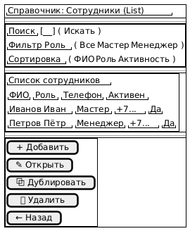            | 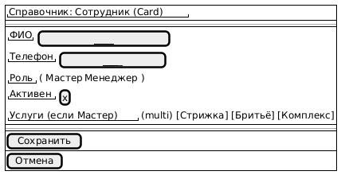 |


# 2.2 Справочник «Услуги»

| Список                                          | Карточка                             |
|-------------------------------------------------|--------------------------------------|
| 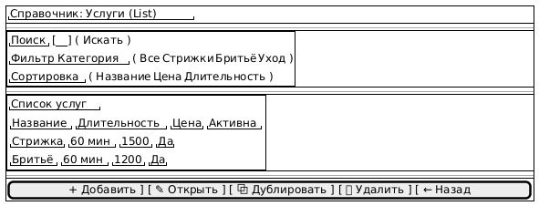            | 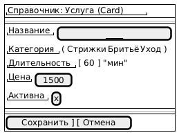 |

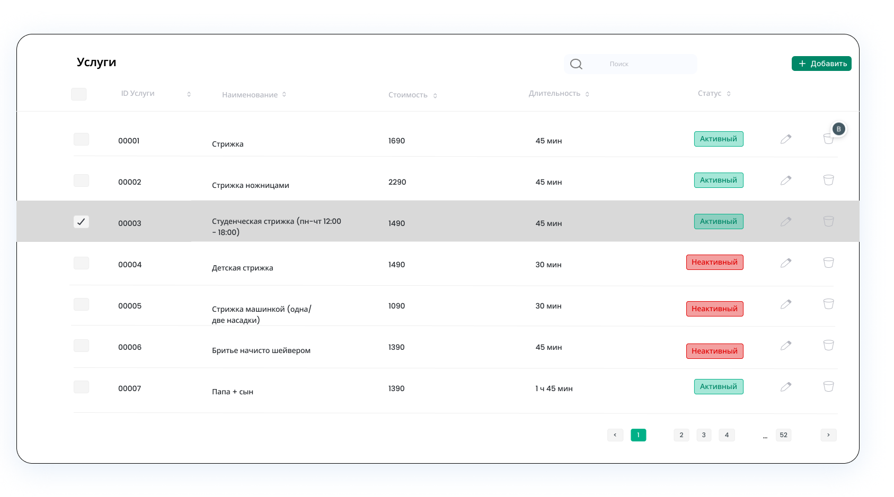   
 
# 2.3 Справочник «Каналы уведомлений»

| Список                                          | Карточка                             |
|-------------------------------------------------|--------------------------------------|
|             |  |

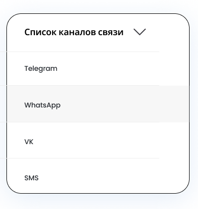   

# 2.4 Матрица «Услуга–Мастер»

| Список                                          | Карточка                             |
|-------------------------------------------------|--------------------------------------|
| 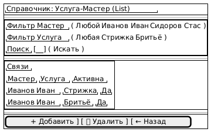            | 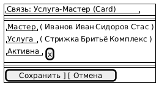 |

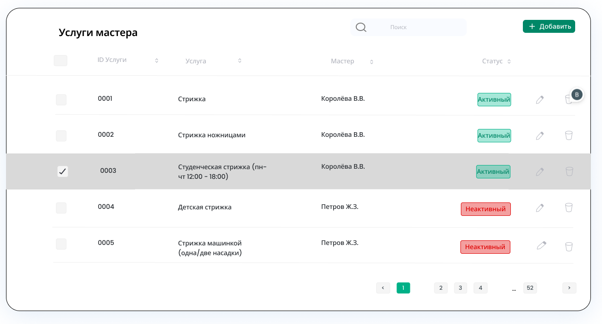   


# 2.5 Дополнительно

| Статус отзыва                                   | Статус улиента                          | Статус слота                         |
|-------------------------------------------------|-----------------------------------------|--------------------------------------| 
| 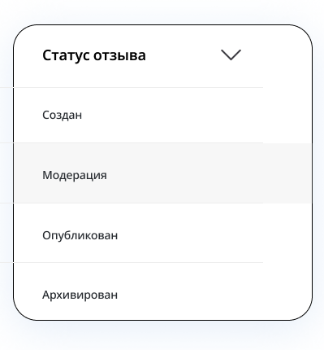              | 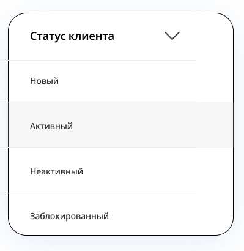    | 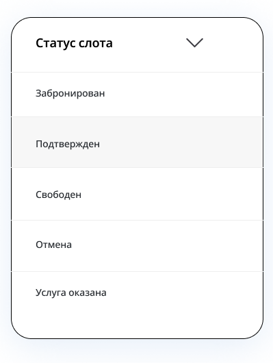   | 


# 3. Основные операции для классификаторов и справочников

- **Создать** 
- **Изменить** 
- **Удалить**
- **Активировать**

## 3.1 Таблица операций


| Сущность           | Операция              | Роли (доступ) | Условия выполнения                                         | Результат в справочнике       | Результат в других частях системы                      |
| ------------------ | --------------------- | ------------- | ---------------------------------------------------------- | ----------------------------- | ------------------------------------------------------ |
| Сотрудники         | Создать               | Менеджер      | Заполнены обязательные поля; роль выбрана                  | Добавлена запись сотрудника   | Сотрудник доступен в выборе мастера/менеджера          |
| Сотрудники         | Изменить              | Менеджер      | Запись существует                                          | Обновлены атрибуты            | Меняется отображение/доступность в расписании и записи |
| Сотрудники         | Удалить               | Менеджер      | Нет ссылок/зависимостей *(или мягкое удаление)*            | Запись удалена/деактивирована | Мастер пропадает из выбора; старые записи сохраняются  |
| Услуги             | Создать               | Менеджер      | Название уникально                                         | Добавлена услуга              | Появляется в выборе услуги при записи                  |
| Услуги             | Изменить              | Менеджер      | Запись существует                                          | Обновлены атрибуты            | Меняются доступные услуги и отчёты                     |
| Услуги             | Удалить               | Менеджер      | Нет активных связей Услуга–Мастер *(или мягкое удаление)*  | Удалена/деактивирована        | Услуга исчезает из выбора; история сохраняется         |
| Каналы уведомлений | Изменить/Активировать | Менеджер      | Канал поддерживается системой                              | Канал активен/неактивен       | Меняется доступность канала для отправки напоминаний   |
| Услуга–Мастер      | Создать               | Менеджер      | Мастер имеет роль “Мастер”; услуга активна                 | Добавлена связь               | Ограничивает списки выбора мастера/услуги в записи     |
| Услуга–Мастер      | Удалить               | Менеджер      | Связь не используется будущими слотами *(или допускается)* | Связь удалена                 | Комбинация мастер/услуга недоступна при записи         |

# 4. Обеспечивающие операции

 - **Поиск** 
 - **Фильтрация**
 - **Сортировка**
 - **Дублирование**
 - **Итоги**

## 4.1 Таблица обеспечивающих операций


| Экран                | Операция     | Поля                         | Поведение по умолчанию                    | Сообщения/результаты                         |
| -------------------- | ------------ | ---------------------------- | ----------------------------------------- | -------------------------------------------- |
| Сотрудники (List)    | Сортировка   | ФИО, Роль, Активность        | ФИО (А→Я)                                 | —                                            |
| Сотрудники (List)    | Фильтрация   | Роль, Активность             | Роль=Все                                  | “Ничего не найдено по фильтру”               |
| Сотрудники (List)    | Поиск        | ФИО, Телефон                 | Частичное совпадение (contains)           | “Сотрудники не найдены”                      |
| Сотрудники (List)    | Дублирование | Дублировать выбранного       | Копируются поля, кроме ID/телефона        | Открывается карточка в режиме редактирования |
| Услуги (List)        | Сортировка   | Название, Цена, Длительность | Название (А→Я)                            | —                                            |
| Услуги (List)        | Фильтрация   | Категория, Активна           | Категория=Все                             | “Нет услуг в категории”                      |
| Услуги (List)        | Поиск        | Название                     | Частичное совпадение                      | “Услуги не найдены”                          |
| Услуги (List)        | Дублирование | Дублировать выбранную        | Копируются поля, имя требует уникальности | Открывается карточка                         |
| Каналы (List)        | Поиск        | Название/Тип                 | Точное или частичное                      | “Каналы не найдены”                          |
| Услуга–Мастер (List) | Фильтрация   | Мастер, Услуга               | Оба=Любой                                 | “Связи не найдены”                           |
| Все List-экраны      | Итоги        | Кол-во записей               | Показывать внизу списка                   | “Показано: N записей”                        |


# 5. Логирование

| Операция | Обязательные атрибуты | Рекомендуемые атрибуты | Формат данных |
|----------|----------------------|------------------------|---------------|
| **Создание** | 1. `entity_id` (новый)<br>2. `payload` (полные данные)<br>3. `status` | 4. `timestamp`<br>5. `user_id` (кто создал)<br>6. `source` (откуда запрос) | JSON: `{"id": "uuid", "payload": {...}, "status": "success", "meta": {...}}` |
| **Изменение** | 1. `entity_id`<br>2. `diff` или `changes`<br>3. `timestamp` | 4. `user_id`<br>5. `reason` (для критичных изменений)<br>6. `old_state` (для важных данных) |  **diff-формат** с old/new: `{"field": {"old": value, "new": value}}` |
| **Удаление/деактивация** | 1. `entity_id`<br>2. `operation_type` (delete/deactivate)<br>3. `timestamp` | 4. `user_id`<br>5. `reason` <br>6. `is_active` (для деактивации)<br>7.  | Для деактивации: `{"is_active": false, "deactivated_at": "timestamp"}` |


## 5.1 Что логируем

| Сущность           | Операции для логирования                  | Когда обязательно | Зачем                                        |
| ------------------ | ----------------------------------------- | ----------------- | -------------------------------------------- |
| Сотрудники         | Создание, Изменение, Удаление/Деактивация | Всегда            | аудит доступа и изменений персонала          |
| Услуги             | Создание, Изменение, Удаление/Деактивация | Всегда            | контроль каталога услуг и расчётов           |
| Каналы уведомлений | Изменение, активация/деактивация          | Всегда            | контроль коммуникаций и политики уведомлений |
| Услуга–Мастер      | Создание/Удаление связи                   | Всегда            | контроль допустимых комбинаций для записи    |

## 5.2 Какие атрибуты сохраняем

| Операция             | Атрибуты (пример)                            |
| -------------------- | -------------------------------------------- |
| Создание             | entity_id (новый), payload (поля), результат |
| Изменение            | entity_id, diff (что изменили), старое/новое |
| Удаление/деактивация | entity_id, причина (если есть), флаг активен |


## 5.3 Служебные поля логирования

| Поле               | Описание                                 |
| ------------------ | ---------------------------------------- |
| timestamp          | дата/время операции                      |
| user_id            | кто выполнил (менеджер)                  |
| user_role          | роль пользователя                        |
| operation          | тип операции (create/update/delete)      |
| entity_type        | тип сущности (Сотрудники/Услуги/…)       |
| entity_id          | идентификатор записи                     |
| correlation_id     | идентификатор запроса/сессии (если есть) |
| client_ip / device | опционально, для расследований           |


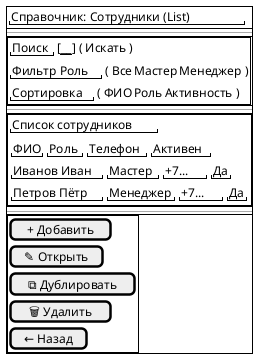


```
@startsalt
{
{#
  { "Справочник: Сотрудник (Card)" }
  ----
  {
    { "ФИО" | [____________________] }
    { "Телефон" | [________________] }
    { "Роль" | ( Мастер | Менеджер ) }
    { "Активен" | [x] }
    { "Услуги (если Мастер)" | (multi) [Стрижка] [Бритьё] [Комплекс] }
  }
  ----
  [ Сохранить ]
  [ Отмена ]
}
}
@endsalt
```
```
@startsalt
{
{#
  { "Справочник: Услуги (List)" }
  ----
  {+
    { "Поиск" | [__________] ( Искать ) }
    { "Фильтр Категория" | ( Все | Стрижки | Бритьё | Уход ) }
    { "Сортировка" | ( Название | Цена | Длительность ) }
  }
  ----
  {+
    { "Список услуг" }
    {
      { "Название" | "Длительность" | "Цена" | "Активна" }
      { "Стрижка" | "60 мин" | "1500" | "Да" }
      { "Бритьё" | "60 мин" | "1200" | "Да" }
    }
  }
  ----
  [ + Добавить ] [ ✎ Открыть ] [ ⧉ Дублировать ] [ 🗑 Удалить ] [ ← Назад ]
}
}
@endsalt
```

```
@startsalt
{
{#
  { "Справочник: Услуга (Card)" }
  ----
  {
    { "Название" | [____________________] }
    { "Категория" | ( Стрижки | Бритьё | Уход ) }
    { "Длительность" | [ 60 ] "мин" }
    { "Цена" | [ 1500 ] }
    { "Активна" | [x] }
  }
  ----
  [ Сохранить ] [ Отмена ]
}
}
@endsalt
```


```
@startsalt
{
{#
  { "Справочник: Каналы уведомлений (List)" }
  ----
  {+
    { "Поиск" | [__________] ( Искать ) }
    { "Сортировка" | ( Название | Тип ) }
  }
  ----
  {+
    { "Список каналов" }
    {
      { "Название" | "Тип" | "Активен" }
      { "Telegram" | "Мессенджер" | "Да" }
      { "SMS" | "СМС" | "Да" }
    }
  }
  ----
  [ + Добавить ] [ ✎ Открыть ] [ 🗑 Удалить ] [ ← Назад ]
}
}
@endsalt
```

```
@startsalt
{
{#
  { "Справочник: Канал уведомлений (Card)" }
  ----
  {
    { "Название" | [__________] }
    { "Тип" | ( Telegram | WhatsApp | VK | SMS ) }
    { "Активен" | [x] }
  }
  ----
  [ Сохранить ] [ Отмена ]
}
}
@endsalt
```

```
@startsalt
{
{#
  { "Справочник: Услуга–Мастер (List)" }
  ----
  {+
    { "Фильтр Мастер" | ( Любой | Иванов Иван | Сидоров Стас ) }
    { "Фильтр Услуга" | ( Любая | Стрижка | Бритьё ) }
    { "Поиск" | [__________] ( Искать ) }
  }
  ----
  {+
    { "Связи" }
    {
      { "Мастер" | "Услуга" | "Активна" }
      { "Иванов Иван" | "Стрижка" | "Да" }
      { "Иванов Иван" | "Бритьё" | "Да" }
    }
  }
  ----
  [ + Добавить ] [ 🗑 Удалить ] [ ← Назад ]
}
}
@endsalt
```

```
@startsalt
{
{#
  { "Связь: Услуга–Мастер (Card)" }
  ----
  {
    { "Мастер" | ( Иванов Иван | Сидоров Стас ) }
    { "Услуга" | ( Стрижка | Бритьё | Комплекс ) }
    { "Активна" | [x] }
  }
  ----
  [ Сохранить ] [ Отмена ]
}
}
@endsalt
```