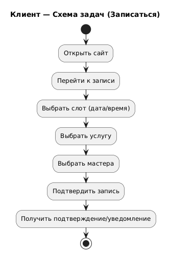
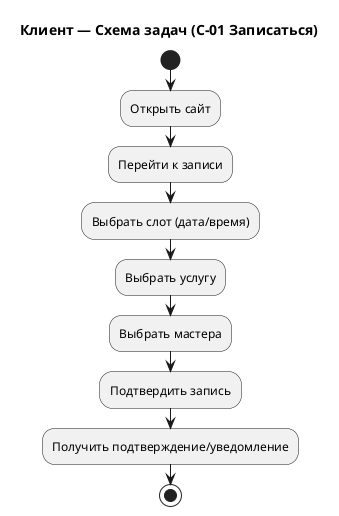

<small>

# Exercise 03 — Ключевые сценарии ролей

Для задачи 1:

1. Разработайте ключевые сценарии основных процессов для каждой роли:
   1. менеджер,
   2. мастер,
   3. клиент.
2. Разработайте схемы задач основных процессов для каждой роли:
   1. задачи отрази прямоугольниками;
   2. перемещение по основному успешному сценарию между задачами отрази стрелками.
3. Составьте ключевые сценарии для выполнения основных процессов каждой роли:
   1. экранные формы отразите в прямоугольниках;
   2. каждую допустимую возможность перемещения укажите как стрелку;
   3. на стрелках отразите условие перехода (действие или переход к действию) в виде, достаточно понятном для разработки;
   4. предусмотрите выход до окончания процесса, без сохранения результатов;
   5. для каждого экрана укажите основное предназначение.
4. Начало и окончание укажите соответствующими элементами.


# Ключевые сценарии ролей


Роли:
- **Клиент** — записывается на услугу, получает уведомления, оставляет отзыв.
- **Менеджер** — ведёт справочники, формирует расписание, управляет записями, фиксирует факт услуги и оплату.
- **Мастер** — просматривает расписание и записи, читает отзывы.

Нотация:
- **Схема задач**: прямоугольники = задачи, стрелки = успешный путь.
- **Ключевой сценарий (экраны)**: прямоугольники = экранные формы, стрелки = переходы с условиями.
- В каждой схеме предусмотрен **выход без сохранения**.

---

# 1. Ключевые сценарии — Клиент

## 1.1 Список ключевых сценариев (Клиент)

| ID   | Сценарий                      | Цель                                          |
|------|-------------------------------|-----------------------------------------------|
| C-01 | Записаться на услугу          | Забронировать слот (дата/время/услуга/мастер) |
| C-02 | Зарегистрироваться (саморег.) | Получить аккаунт для удобства/истории         |
| C-03 | Отменить запись               | Освободить слот и корректно завершить визит   |
| C-04 | Оставить отзыв                | Оценить услугу после визита                   |

---

## 1.2 Схема задач (Клиент) — основной успешный сценарий (C-01)

   


### 1.3 Ключевой сценарий по экранам (Клиент) — C-01 Записаться

Принцип выбора (в рамках UC03): основной путь — выбор слота → услуга → мастер.  
Альтернативы (выбор по услуге/по мастеру) можно добавить позже как расширение.

.png)   


# 2. Ключевые сценарии — Менеджер

## 2.1 Список ключевых сценариев (Менеджер)

| ID   | Сценарий                                          | Цель                                      |
| ---- | ------------------------------------------------- | ----------------------------------------- |
| M-01 | Вести справочники (сотрудники/услуги/каналы)      | Поддерживать актуальные данные            |
| M-02 | Сформировать расписание мастеров (слоты)          | Сделать доступные слоты для записи        |
| M-03 | Управлять записями (перенос/отмена/подтверждение) | Поддерживать корректность расписания      |
| M-04 | Закрыть визит и принять оплату                    | Фиксировать факт оказания услуги и оплату |
| M-05 | Просмотреть отчёты и отзывы                       | Контроль качества и результата            |


## 2.2 Схема задач (Менеджер) — основной успешный сценарий (M-02)


.png)   


## 2.3 Ключевой сценарий по экранам (Менеджер) — M-02 Сформировать расписание

Важно (условия перехода):  
При сохранении слота: проверка “слот не забронирован”.  
При конфликте: показать сообщение и предложить выбрать другое время (из UC02 альтернативы).  

.png)   


# 3. Ключевые сценарии — Мастер

## 3.1 Список ключевых сценариев (Мастер)

| ID   | Сценарий                            | Цель                         |
| ---- | ----------------------------------- | ---------------------------- |
| B-01 | Посмотреть своё расписание          | Увидеть план на день/неделю  |
| B-02 | Посмотреть записи клиентов по слоту | Понять, кто и на что записан |
| B-03 | Просмотреть отзывы                  | Получить обратную связь      |

# 3.2 Схема задач (Мастер) — основной успешный сценарий (B-01)


.png)   


## 3.3 Ключевой сценарий по экранам (Мастер) — B-01 Просмотр расписания


.png)   


```
@startuml
title Менеджер — Экраны и переходы (M-02 Расписание)

start

rectangle "M-SCR-01 Вход\nНазначение: аутентификация менеджера" as M1
rectangle "M-SCR-02 Панель менеджера\nНазначение: навигация" as M2
rectangle "M-SCR-03 Расписание мастеров (List)\nНазначение: список слотов и фильтры" as M3
rectangle "M-SCR-04 Создать/Изменить слот (Card)\nНазначение: задать дату/время/мастера" as M4
rectangle "M-SCR-05 Результат\nНазначение: подтверждение сохранения" as M5

M1 --> M2 : Успешный вход
M2 --> M3 : Открыть "Расписание"
M3 --> M4 : Нажать "+ Добавить слот"\nили "Изменить слот"
M4 --> M5 : "Сохранить"\n+ проверка "слот не забронирован"
M5 --> M3 : Вернуться к списку слотов
M3 --> stop : Выйти/закрыть

' Выход без сохранения
M4 --> M3 : "Отмена" (не сохранять)
M3 --> stop : "Назад" / закрыть без изменений

@enduml
```

```
@startuml
title Мастер — Экраны и переходы (B-01 Моё расписание)

start

rectangle "B-SCR-01 Вход\nНазначение: аутентификация мастера" as B1
rectangle "B-SCR-02 Панель мастера\nНазначение: навигация" as B2
rectangle "B-SCR-03 Моё расписание (List)\nНазначение: слоты и записи" as B3
rectangle "B-SCR-04 Детали записи (Card)\nНазначение: клиент/услуга/время" as B4

B1 --> B2 : Успешный вход
B2 --> B3 : Открыть "Моё расписание"
B3 --> B4 : Открыть слот с записью
B4 --> B3 : "Назад"
B3 --> stop : Выйти/закрыть

' Выход без сохранения
B4 --> stop : Закрыть страницу (без изменений)
B3 --> stop : Закрыть (без изменений)

@enduml
```


```
@startuml
title Мастер — Схема задач (B-01 Просмотр расписания)

start
:Войти;
:Открыть "Моё расписание";
:Выбрать дату/период;
:Просмотреть слоты и записи;
stop
@enduml
```

```
@startuml
title Менеджер — Схема задач (M-02 Сформировать расписание)

start
:Войти в админку;
:Открыть расписание;
:Выбрать мастера;
:Выбрать дату;
:Добавить слот(ы);
:Сохранить;
:Убедиться, что слот доступен клиентам;
stop
@enduml
```





```
@startuml
title Запись на услугу (Клиент)

start

:Главная/Лендинг;
note right
  **Назначение:**
  Вход в процесс записи
end note

:Нажать "Записаться";

:Выбор услуги;
note right
  **Назначение:**
  Выбрать услугу из списка
end note

if (Услуга выбрана?) then (Да)
  :Выбор мастера;
  note right
    **Назначение:**
    Выбрать мастера
    для выбранной услуги
  end note
  
  if (Мастер выбран?) then (Да)
    :Выбор даты/времени;
    note right
      **Назначение:**
      Выбрать свободный слот
      у выбранного мастера
    end note
    
    if (Слот выбран?) then (Да)
      :Подтверждение записи;
      note right
        **Назначение:**
        Финальное подтверждение
        данных бронирования
      end note
      
      if (Подтверждено?) then (Да)
        :Проверка доступности слота;
        
        if (Слот ещё свободен?) then (Да)
          :Создание записи;
          :Показать результат (успех);
          stop
        else (Нет, занят)
          :Показать ошибку "Слот занят";
          :Вернуться к выбору слота;
          detach
        endif
      else (Нет)
        :Отмена записи;
        stop
      endif
    else (Нет)
      :Отмена записи;
      stop
    endif
  else (Нет)
    :Отмена записи;
    stop
  endif
else (Нет)
  :Отмена записи;
  stop
endif

@enduml
```

```
@startuml
title Activity Diagram: Управление расписанием (Менеджер)

start
:Аутентификация менеджера;

if (Успешно?) then (Да)
  :Панель менеджера;
  
  if (Выбрано "Расписание"?) then (Да)
    :Просмотр расписания мастеров;
    
    repeat
      :Применить фильтры при необходимости;
      
      if (Действие со слотом?) then (Да)
        if (Действие = "Создать"?) then (Да)
          :Заполнить форму нового слота;
        elseif (Действие = "Редактировать"?) then (Да)
          :Редактировать данные слота;
        elseif (Действие = "Удалить"?) then (Да)
          :Подтвердить удаление;
        endif
        
        if (Сохранить изменения?) then (Да)
          :Проверить конфликты расписания;
          
          if (Конфликтов нет?) then (Да)
            :Сохранить изменения;
            :Показать уведомление об успехе;
          else (Есть конфликты)
            :Показать ошибку конфликта;
            :Вернуться к форме;
          endif
        else (Отмена)
          :Отменить изменения;
        endif
      endif
      
    repeat while (Продолжить работу с расписанием?) is (Да)
  endif
endif

:Завершение работы;
stop
```


```
@startuml
title Клиент — Экраны и переходы (C-01 Записаться)

start

rectangle "C-SCR-01 Главная/Лендинг\nНазначение: вход в запись" as C1
rectangle "C-SCR-02 Выбор слота\nНазначение: выбрать дату/время из свободных" as C2
rectangle "C-SCR-03 Выбор услуги\nНазначение: выбрать услугу из допустимых" as C3
rectangle "C-SCR-04 Выбор мастера\nНазначение: выбрать мастера из допустимых" as C4
rectangle "C-SCR-05 Подтверждение записи\nНазначение: финально подтвердить бронирование" as C5
rectangle "C-SCR-06 Результат\nНазначение: показать успех + детали записи" as C6

C1 --> C2 : Нажать "Записаться"
C2 --> C3 : Выбран слот (дата/время)\nи нажата "Далее"
C3 --> C4 : Выбрана услуга\nи нажата "Далее"
C4 --> C5 : Выбран мастер\nи нажата "Далее"
C5 --> C6 : Нажать "Подтвердить"\n+ проверка "слот свободен"
C6 --> stop : Закрыть/вернуться на главную

' Выход без сохранения
C2 --> stop : "Отмена" / закрыть страницу
C3 --> C2 : "Назад"
C3 --> stop : "Отмена"
C4 --> C3 : "Назад"
C4 --> stop : "Отмена"
C5 --> C4 : "Назад"
C5 --> stop : "Отмена" (не бронировать)

@enduml
```
