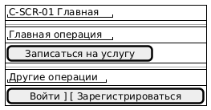
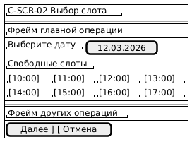
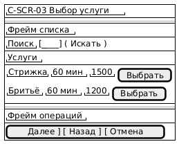
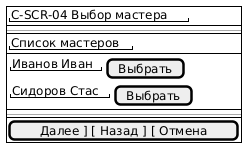
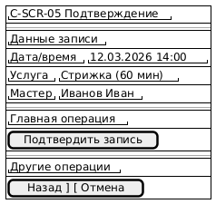
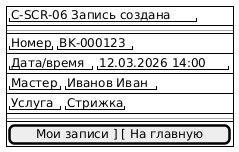
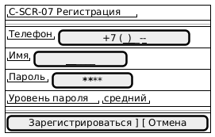
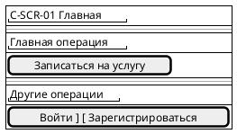

<small>

# Exercise 05 — Экранные формы (wireframe)

Для задачи 1 для каждой экранной формы из перечисленных в Ex.04:

1. Разработайте (нарисуйте любым способом) макет (эскиз) экранной формы, укажи:
   1. название формы;
   2. фрейм главной операции;
   3. фрейм(-ы) других операций;
   4. вызовы операций, перехода далее и отказа от операции;
   5. фреймы данных (списком и карточкой);
   6. роль(-и) пользователей, которым доступен экран.
2. Опишите основные операции:
   1. права доступа по ролям к операции;
   2. условия выполнения операций;
   3. результат операции в зависимости от условий:
      1. над данными в текущем окне,
      2. в других частях системы. 
3. Опишите обеспечивающие операции:
   1. сортировка, поля сортировки, состояние по умолчанию;
   2. фильтрация, поля фильтрации, сохранение фильтров, сообщения при отсутствии результата;
   3. поиск, поля поиска, точность совпадения, сообщения при отсутствии результата;
   4. дублирование из другой записи при добавлении (если есть);
   5. расчет итогов (если есть).
4. Опишите данные:
   1. Укажите объект/класс данных;
   2. Опишите форму списка данных:
      1. пагинация,
      2. краткое наименование поля,
      3. мнемоника (если есть),
      4. описание,
      5. формат представления (см. ex.02, 1.с.);
   3. Опишите форму карточки данных:
      1. пагинация,
      2. краткое наименование поля,
      3. описание,
      4. формат представления (см. ex.02, 1.с.).
5. Укажите логирование:
   1. операции, требующие логирования;
   2. атрибуты, сохраняемые при логировании;
   3. служебные поля, требующие логирования.  
6. Результаты представьте в табличном виде, допустимо в нескольких таблицах.


# Экранные формы (wireframe)

 

- **унифицированный шаблон описания экрана** (одинаковый состав таблиц),
- заполнен для **всех ключевых экранов основных процессов** (клиент/менеджер/мастер).
- *все* экраны из Ex.04, включая “результат/панели/входы”, — также включены, но в компактном формате (wireframe + операции + данные + логирование).

Легенда ролей: 
**C** (Client),   
**M** (Manager),   
**B** (Barber/Master)    

Доступ: **R/C/U/D**

##  Общие элементы wireframe (используются на всех экранах)

###  Визуализация и сообщения
- Неопределённое значение: `—`
- Обрезка: `…` + tooltip
- Пустая выборка: `Ничего не найдено`
- Запрет удаления: `Удаление недоступно. Используйте деактивацию.`

### Общие поля логирования

| Поле           | Описание |
|----------------|---------------|
| timestamp      | дата/время |
| user_id        | идентификатор пользователя |
| user_role      | роль пользователя |
| operation      | create/update/delete/view |
| entity_type    | тип сущности |
| entity_id      | идентификатор записи |
| correlation_id | id запроса/сессии |

---

# 1. Экраны Клиента

#  1.1 C-SCR-01 — Главная/Лендинг

**Роли:** C (R), M (R), B (R)

## Экранная форма



## Основные операции

| Операция           | Доступ | Условия | Результат в окне    | Результат в системе |
| ------------------ | ------ | ------- | ------------------- | ------------------- |
| Начать запись      | C:R    | —       | переход на C-SCR-02 | —                   |
| Войти              | C:R    | —       | переход на C-SCR-08 | —                   |
| Зарегистрироваться | C:R    | —       | переход на C-SCR-07 | —                   |

## Обеспечивающие операции

Нет.

## Даныне

| Класс данных      | Список/Карточка | Поля          |
| ----------------- | --------------- | ------------- |
| Контент/Навигация | —               | ссылки/кнопки |

## Логирование

| Операция | Логировать | Атрибуты  |
| -------- | ---------- | --------- |
| view     | да         | screen_id |


# 1.2 C-SCR-02 — Выбор слота (свободное время)

Роли: C (R), M (R), B (R)

## Экранная форма



## Основные операции

| Операция     | Доступ | Условия       | Результат в окне       | Результат в системе |
| ------------ | ------ | ------------- | ---------------------- | ------------------- |
| Выбрать слот | C:R    | слот свободен | слот отмечен выбранным | —                   |
| Далее        | C:R    | слот выбран   | переход на C-SCR-03    | —                   |
| Отмена       | C:R    | —             | выход без сохранения   | —                   |

## Обеспечивающие операции

| Операция       | Поля          | По умолчанию              | Сохранять | Сообщение при пусто                      |
| -------------- | ------------- | ------------------------- | --------- | ---------------------------------------- |
| Фильтр по дате | дата          | сегодня                   | нет       | `Нет свободных слотов на выбранную дату` |
| Сортировка     | время         | по времени ↑              | нет       | —                                        |
| Поиск          | —             | —                         | —         | —                                        |
| Итоги          | кол-во слотов | показывать `Свободных: N` | —         | —                                        |

## Данные

Список (pagination): да (если много дней/слотов), 20-50 элементов

| Поле        | Мнемо   |  Описание   | Формат       |
|-------------|---------|-------------|--------------|
| Дата        | date    | день        | date         |
| ВремяНачала | time    | старт часа  | time (HH:MM) |
| Свободен    | is_free | доступность | bool         |


## Логирование

| Операция    | Логировать | Атрибуты      |
| ----------- | ---------- | ------------- |
| view        | да         | date_filter   |
| select_slot | да         | slot_datetime |


# 1.3 C-SCR-03 — Выбор услуги

Роли: C (R), M (R), B (R)


## Экранная форма



## Основные операции

| Операция       | Доступ | Условия        | Результат в окне          | Результат в системе |
| -------------- | ------ | -------------- | ------------------------- | ------------------- |
| Выбрать услугу | C:R    | услуга активна | услуга отмечена выбранной | —                   |
| Далее          | C:R    | услуга выбрана | переход на C-SCR-04       | —                   |
| Назад          | C:R    | —              | возврат на C-SCR-02       | —                   |
| Отмена         | C:R    | —              | выход                     | —                   |

## Обеспечивающие операции


| Операция   | Поля                       | По умолчанию  | Сохранять | Сообщение при пусто     |
| ---------- | -------------------------- | ------------- | --------- | ----------------------- |
| Поиск      | название                   | пусто         | нет       | `Услуги не найдены`     |
| Сортировка | название/цена/длительность | название ↑    | нет       | —                       |
| Фильтрация | категория (опц.)           | все           | нет       | `Нет услуг в категории` |
| Итоги      | кол-во услуг               | `Показано: N` | —         | —                       |

## Данные

Услуги

Список (pagination): да (20/стр)

| Поле         | Описание   | Формат     |
|--------------|------------|--------------|
| Название     | имя услуги | string(80)   |
| Длительность | мин        | int(15..240) |
| Цена         | стоимость  | money        |
| Активна      | доступна   | bool         |
 
Карточка: не требуется (детали минимальны).

## Логирование

| Операция       | Логировать | Атрибуты   |
| -------------- | ---------- | ---------- |
| select_service | да         | service_id |


# 1.4 C-SCR-04 — Выбор мастера

Роли: C (R), M (R), B (R)


## Экранная форма



## Основные операции

| Операция        | Доступ | Условия                           | Результат в окне    | Результат в системе |
| --------------- | ------ | --------------------------------- | ------------------- | ------------------- |
| Выбрать мастера | C:R    | мастер активен и выполняет услугу | выбран мастер       | —                   |
| Далее           | C:R    | мастер выбран                     | переход на C-SCR-05 | —                   |
| Назад           | C:R    | —                                 | назад на C-SCR-03   | —                   |
| Отмена          | C:R    | —                                 | выход               | —                   |


## Обеспечивающие операции

| Операция     | Поля | По умолчанию  | Сообщение при пусто  |
| ------------ | ---- | ------------- | -------------------- |
| Сортировка   | ФИО  | ФИО ↑         | —                    |
| Поиск (опц.) | ФИО  | пусто         | `Мастера не найдены` |
| Итоги        | N    | `Показано: N` | —                    |


## Данные

Сотрудник (проекция мастер)

Список: да

| Поле    | Описание | Формат |
|---------|----------|--------|
| ФИО     | имя      | string |
| Активен | доступен | bool   |

Связь-ограничение: ServiceMasterMatrix (мастер должен выполнять выбранную услугу).

## Логирование

| Операция      | Логировать | Атрибуты  |
| ------------- | ---------- | --------- |
| select_master | да         | master_id |


# 1.5 C-SCR-05 — Подтверждение записи

Роли: C (C), M (R), B (R)


## Экранная форма



## Основные операции


| Операция    | Доступ | Условия               | Результат в окне            | Результат в системе                               |
| ----------- | ------ | --------------------- | --------------------------- | ------------------------------------------------- |
| Подтвердить | C:C    | слот всё ещё свободен | переход на экран результата | создаётся запись Booking; слот становится занятым |
| Назад       | C:R    | —                     | назад на C-SCR-04           | —                                                 |
| Отмена      | C:R    | —                     | выход без сохранения        | —                                                 |

Негативный результат (конфликт слота):  
Сообщение: Слот уже занят. Выберите другое время.  
Переход: обратно на C-SCR-02

## Обеспечивающие операции

Нет (только подтверждение).

## Данные

Запись слота Слот

| Поле         | Описание   | Формат   |
| ------------ | ---------- | -------- |
| datetime     | дата/время | datetime |
| service_id   | услуга     | ref      |
| master_id    | мастер     | ref      |
| client_phone | телефон    | string   |


## Логирование


| Операция       | Логировать | Атрибуты                                         |
| -------------- | ---------- | ------------------------------------------------ |
| create_booking | да         | booking_id, slot_datetime, service_id, master_id |


# 1.6 C-SCR-06 — Результат записи

Роли: C (R), M (R), B (R)

## Экранная форма



**Операции:** переходы, логирование view.

# 1.7 C-SCR-07 — Регистрация

Роли: C (C)

## Экранная форма




**Операции:** create Client, проверки телефона уникальность, пароль strength.  
**Логирование:** create_client.

# 1.8 C-SCR-08 — Вход

Роли: C (R)

**Экранные формы:** телефон/пароль, кнопки Войти/Отмена.  
**Логирование:** login_attempt, login_success/fail.

# 1.9 C-SCR-09 — Мои записи (List)

Роли: C (R)

**Экранные формы:** список записей (дата/время/услуга/мастер/статус), открыть, отменить (если разрешено).  
**Обеспечивающие:** сортировка по дате desc, фильтр по статусу, итоги N.

# 1.10 C-SCR-10 — Детали записи (Card)

Роли: C (R)

**Экранные формы:** детали + кнопка Отменить (если статус позволяет) + Назад.

# 1.11 C-SCR-11 — Отзыв

Роли: C (C)

**Экранные формы:** оценка (1..5), комментарий, отправить/отмена.
**Логирование:** create_review.

# 2. Экраны Менеджера (админка)


# 2.1 M-SCR-03 — Справочник «Сотрудники» (List)

Роли: M (CRUD), B (R)

## Экранная форма

.png)


## Основные операции (права/условия/результат)


| Операция               | Доступ (C/M/B) | Условия                          | Результат в окне          | Результат в системе              |
| ---------------------- | -------------- | -------------------------------- | ------------------------- | -------------------------------- |
| Создать сотрудника     | — / C / —      | обязательные поля                | открыта карточка M-SCR-04 | создан Employee                  |
| Изменить               | — / U / —      | запись существует                | карточка редактирования   | обновлён Employee                |
| Дублировать            | — / C / —      | выбран сотрудник                 | карточка с копией         | новый Employee после сохранения  |
| Удалить/Деактивировать | — / D / —      | нет крит. ссылок или soft-delete | запись скрыта/помечена    | сотрудник не доступен для записи |
| Просмотр               | — / R / R      | —                                | отображение списка        | —                                |


### Обеспечивающие операции


| Операция   | Поля             | По умолч.  | Сохр. | Пусто                   |
| ---------- | ---------------- | ---------- | ----- | ----------------------- |
| Сортировка | ФИО/Роль/Активен | ФИО ↑      | да    | —                       |
| Фильтр     | Роль, Активен    | Все        | да    | `Нет записей`           |
| Поиск      | ФИО, телефон     | contains   | нет   | `Сотрудники не найдены` |
| Итоги      | N, активных M    | показывать | —     | —                       |


## Данные

Сотрудник (List)

пагинация: да, 20/стр

| Поле      | Описание | Формат     |
|-----------|----------|------------|
| full_name | ФИО     | string(120) |
| role      | роль    | enum        |
| phone     | телефон | string(20)  |
| is_active | активен | bool        |

Карточка: см. M-SCR-04.

## Логирование


| Операция             | Логировать | Атрибуты       |
| -------------------- | ---------- | -------------- |
| create/update/delete | да         | diff/payload   |
| view/search/filter   | да (опц.)  | filters        |


# 2.2  M-SCR-04 — «Сотрудник» (Card)

Роли: M (CRUD)

## Экранная форма

.png)

## Основные операции


| Операция  | Доступ | Условия       | Результат в окне       | Результат в системе    |
| --------- | ------ | ------------- | ---------------------- | ---------------------- |
| Сохранить | M: C/U | валидные поля | возврат в список       | create/update Employee |
| Отмена    | M:R    | —             | возврат без сохранения | —                      |


## Обеспечивающие операции

Нет (кроме подсказок/масок ввода).

## Данные (Card)

Сотрудник

| Поле      | Описание       | Формат                          |
| --------- | -------------- | ------------------------------- |
| full_name | ФИО            | string(120), required           |
| phone     | телефон        | string(20), required, unique    |
| role      | роль           | enum, required                  |
| is_active | активен        | bool, default true              |
| services  | услуги мастера | refs[], required if role=Master |


##  Логирование

create/update + payload/diff.

# 2.3  M-SCR-06/M-SCR-07 — «Услуги» (List/Card)

Аналогично структуре “Сотрудники”: поиск/фильтр/сорт + CRUD + soft-delete.  
Данные и проверки — см. Exercise 02 (REF-02).

# 2.4  M-SCR-12/M-SCR-13 — «Расписание / Слоты» (List/Card)

Роли: M (CRUD), B (R), C (R — только свободные)


## Экранная форма

.png)

## Экранная форма

.png)


**Операции/условия:**

Сохранить: слот не должен пересекаться с существующим слотом мастера; слот не должен быть забронирован при изменении.  
Удаление: если слот занят — только перенос/операции с записью или запрет.  
Логирование: create/update/delete slot.  

# 2.5  M-SCR-14/M-SCR-15 — «Записи» (List/Card)

Роли: M (CRUD), B (R — только свои), C (R — только свои)  

List: фильтры по дате/статусу/мастеру; операции перенос/отмена/закрыть визит.  
Card: детали записи + смена статуса + связь с клиентом.  

**Логирование:** update booking status, cancel/reschedule.

# 3. Экраны Мастера

## 3.1  B-SCR-03 — Моё расписание (List)

Роли: B (R), M (R)


## Экранная форма


## Основные операции

| Операция       | Доступ | Условия                                 | Результат в окне    | Результат в системе |
| -------------- | ------ | --------------------------------------- | ------------------- | ------------------- |
| Открыть запись | B:R    | запись существует и принадлежит мастеру | переход на B-SCR-04 | —                   |
| Назад/выход    | B:R    | —                                       | выход               | —                   |


##  Обеспечивающие операции

| Операция       | Поля  | По умолч.   | Пусто                 |
| -------------- | ----- | ----------- | --------------------- |
| Фильтр по дате | дата  | сегодня     | `Нет записей на дату` |
| Сортировка     | время | время ↑     | —                     |
| Итоги          | N     | `Слотов: N` | —                     |


##  Данные

Слот Просмотр бронирования

| Поле         | Описание             | Формат   |
| ------------ | -------------------- | -------- |
| time         | время                | time     |
| client_hint  | клиент (ограниченно) | string/— |
| service_name | услуга               | string   |
| status       | статус               | enum     |


##  Логирование

view + open_booking.

#  3.2  B-SCR-04 — Детали записи (Card)

Роли: B (R)

**Экранные формы:** дата/время, услуга, клиент (минимум: имя/телефон по политике), статус.  
**Операции:** только просмотр/назад.  
**Логирование:** view_booking.  

#  Компактные экраны (вход/панели/результаты)


# 4.1 Входы (C-SCR-08, M-SCR-01, B-SCR-01)

**Экранные формы:**  логин/пароль + “Войти/Отмена”  
**Основная операция:** login  
**Логирование:** login_attempt, login_success/fail  

# 4.2 Панели (M-SCR-02, B-SCR-02)

**Экранные формы:** кнопки навигации по разделам  
**Операции:** переходы, view  
**Логирование:** view  

# 4.3 Результаты (C-SCR-06, M-SCR-05)

**Экранные формы:** сообщение успеха + переходы
**Операции:** view, navigate

##  Реестр логирования (сводно)

| Сущность | Логируемые операции                  | Атрибуты                   |
| -------- | ------------------------------------ | -------------------------- |
| Employee | create/update/delete/view            | payload/diff               |
| Service  | create/update/delete/view            | payload/diff               |
| Slot     | create/update/delete/view            | datetime, master_id        |
| Booking  | create/update/cancel/reschedule/view | booking_id, old/new status |
| Review   | create/view                          | rating, booking_id         |





```
@startsalt
{
{#
  { "C-SCR-02 Выбор слота" }
  ----
  { "Фрейм главной операции" }
  { "Выберите дату" | [ 12.03.2026 ] }
  { "Свободные слоты" }
  {
    { "[10:00]" | "[11:00]" | "[12:00]" | "[13:00]" }
    { "[14:00]" | "[15:00]" | "[16:00]" | "[17:00]" }
  }
  ----
  { "Фрейм других операций" }
  [ Далее ] [ Отмена ]
}
}
@endsalt
```


```
@startsalt
{
{#
  { "C-SCR-03 Выбор услуги" }
  ----
  { "Фрейм списка" }
  { "Поиск" | [________] ( Искать ) }
  { "Услуги" }
  {
    { "Стрижка" | "60 мин" | "1500" | [ Выбрать ] }
    { "Бритьё" | "60 мин" | "1200" | [ Выбрать ] }
  }
  ----
  { "Фрейм операций" }
  [ Далее ] [ Назад ] [ Отмена ]
}
}
@endsalt
```


```
@startsalt
{
{#
  { "C-SCR-04 Выбор мастера" }
  ----
  { "Список мастеров" }
  {
    { "Иванов Иван" | [ Выбрать ] }
    { "Сидоров Стас" | [ Выбрать ] }
  }
  ----
  [ Далее ] [ Назад ] [ Отмена ]
}
}
@endsalt
```

```
@startsalt
{
{#
  { "C-SCR-05 Подтверждение" }
  ----
  { "Данные записи" }
  { "Дата/время" | "12.03.2026 14:00" }
  { "Услуга" | "Стрижка (60 мин)" }
  { "Мастер" | "Иванов Иван" }
  ----
  { "Главная операция" }
  [ Подтвердить запись ]
  ----
  { "Другие операции" }
  [ Назад ] [ Отмена ]
}
}
@endsalt
```


```
@startsalt
{
{#
  { "C-SCR-06 Запись создана" }
  ----
  { "Номер" | "BK-000123" }
  { "Дата/время" | "12.03.2026 14:00" }
  { "Мастер" | "Иванов Иван" }
  { "Услуга" | "Стрижка" }
  ----
  [ Мои записи ] [ На главную ]
}
}
@endsalt
```


```
@startsalt
{
{#
  { "C-SCR-07 Регистрация" }
  ----
  { "Телефон" | [ +7 (___) ___-__-__ ] }
  { "Имя" | [______________] }
  { "Пароль" | [************] }
  { "Уровень пароля" | "средний" }
  ----
  [ Зарегистрироваться ] [ Отмена ]
}
}
@endsalt
```

```
@startsalt
{
{#
  { "M-SCR-03 Сотрудники (List)" }
  ----
  { "Поиск" | [________] ( Искать ) }
  { "Фильтр Роль" | ( Все | Мастер | Менеджер ) }
  { "Сортировка" | ( ФИО | Роль | Активность ) }
  ----
  { "Список" }
  {
    { "ФИО" | "Роль" | "Телефон" | "Активен" }
    { "Иванов Иван" | "Мастер" | "+7..." | "Да" }
  }
  ----
  [ + Добавить ] [ ✎ Открыть ] [ ⧉ Дублировать ] [ 🗑 Удалить ] [ Назад ]
}
}
@endsalt
```


```
@startsalt
{
{#
  { "M-SCR-04 Сотрудник (Card)" }
  ----
  { "ФИО" | [____________________] }
  { "Телефон" | [ +7 (___) ___-__-__ ] }
  { "Роль" | ( Мастер | Менеджер ) }
  { "Активен" | [x] }
  { "Услуги (если мастер)" | (multi) [Стрижка] [Бритьё] [Комплекс] }
  ----
  [ Сохранить ] [ Отмена ]
}
}
@endsalt
```


```
@startsalt
{
{#
  { "M-SCR-12 Расписание (List)" }
  ----
  { "Дата" | [ 12.03.2026 ] }
  { "Мастер" | ( Все | Иванов Иван | Сидоров Стас ) }
  { "Статус" | ( Все | Свободен | Занят ) }
  ----
  { "Слоты" }
  {
    { "Время" | "Мастер" | "Статус" }
    { "14:00" | "Иванов Иван" | "Свободен" }
    { "15:00" | "Иванов Иван" | "Занят" }
  }
  ----
  [ + Добавить слот ] [ ✎ Открыть ] [ 🗑 Удалить/Деактивировать ] [ Назад ]
}
}
@endsalt
```


```
Wireframe Card (Salt)


@startsalt
{
{#
  { "M-SCR-13 Слот (Card)" }
  ----
  { "Дата" | [ 12.03.2026 ] }
  { "Время" | [ 14:00 ] }
  { "Мастер" | ( Иванов Иван | Сидоров Стас ) }
  ----
  [ Сохранить ] [ Отмена ]
}
}
@endsalt
```


```
@startsalt
{
{#
  { "B-SCR-03 Моё расписание" }
  ----
  { "Дата" | [ 12.03.2026 ] }
  ----
  { "Список слотов" }
  {
    { "Время" | "Клиент" | "Услуга" | "Статус" | "Открыть" }
    { "14:00" | "—" | "Стрижка" | "Заплан." | [ > ] }
  }
  ----
  [ Назад ]
}
}
@endsalt
```
